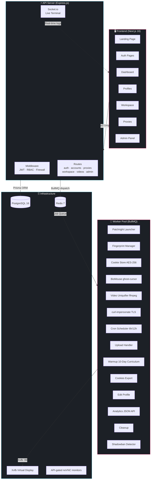
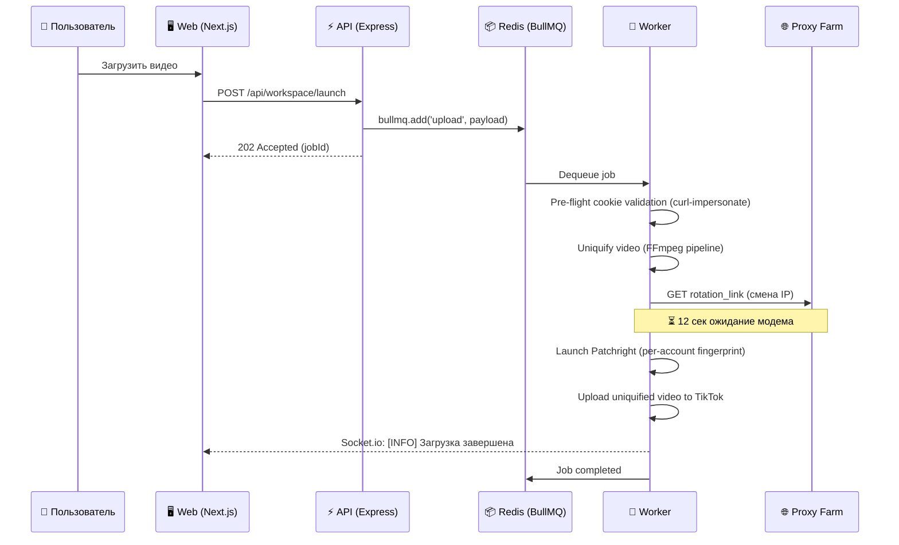
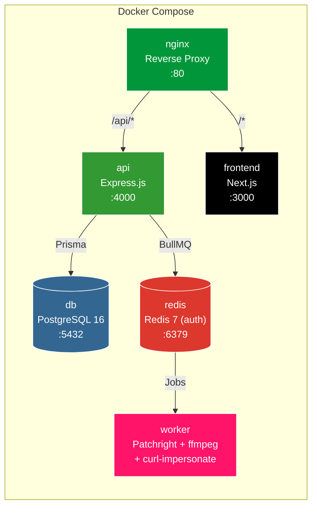
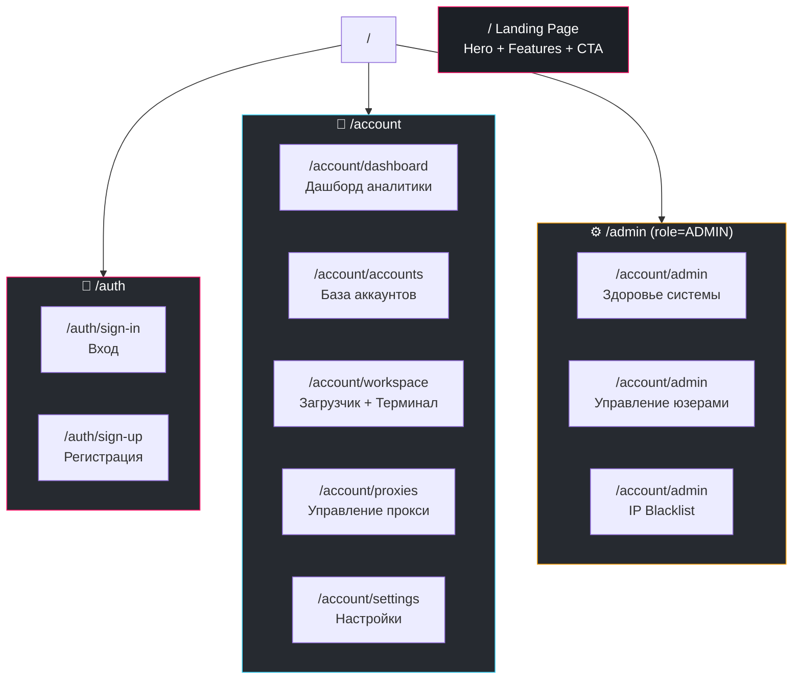
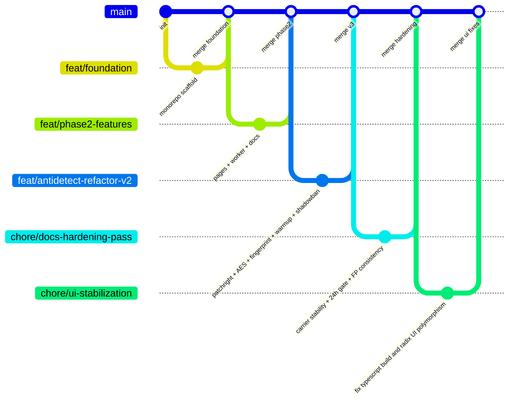

<div align="center">


# MelonityMedia

**Панель автоматизации для вертикального видеоконтента**

Полнофункциональная SPA-панель для массового залива видео на TikTok и YouTube Shorts,
прогрева аккаунтов, детекции шэдоубана и сбора аналитики.

[](https://www.typescriptlang.org/)
[](https://nextjs.org/)
[](https://nodejs.org/)
[](https://www.prisma.io/)
[](https://redis.io/)
[](https://www.docker.com/)

</div>

---

## 📋 Содержание

- [Обзор](#-обзор)
- [Архитектура](#-архитектура)
- [Стек технологий](#-стек-технологий)
- [Что внутри](#-что-внутри)
- [Быстрый старт](#-быстрый-старт)
- [Docker (Production)](#-docker-production)
- [Карта интерфейса](#-карта-интерфейса)
- [Система очередей](#-система-очередей)
- [Дизайн-система](#-дизайн-система)
- [UI-компоненты](#-ui-компоненты)
- [API-эндпоинты](#-api-эндпоинты)
- [Безопасность](#-безопасность)
- [Переменные окружения](#-переменные-окружения)
- [Git Workflow](#-git-workflow)
- [Документация](#-документация)
- [Лицензия](#-лицензия)

---

## 🎯 Обзор

MelonityMedia — закрытая платформа для арбитражников вертикального видеоконтента. Система автоматизирует полный цикл работы с аккаунтами TikTok и YouTube Shorts:

| Функция | Описание |
|---------|----------|
| 🎬 **Массовый залив** | Загрузка уникализированных видео через Patchright (антидетект-CDP) с per-account fingerprint |
| 🎥 **YouTube Shorts** | Полноценная поддержка загрузки коротких видео на YouTube |
| 🔐 **Google/YouTube Login** | Автоматическая авторизация через Google с resilient-селекторами, rate-limit detection и CAPTCHA-обнаружением |
| 🔑 **TikTok 2FA** | Поддержка двухфакторной аутентификации: SMS, Email, Authenticator + email verification detection |
| 🔥 **Прогрев аккаунтов** | Niche-focused warmup v4: human-like search по хэштегам, progressive curriculum (passive → active), **self-rescheduling** 20-28ч |
| 🍪 **Умный импорт** | Двойной формат: cookies (JSON) и login:password, привязка прокси при импорте, авто-создание профилей |
| 🔄 **Cookie refresh** | Lightweight продление сессий через Patchright (5-10 мин FYP scrolling), обновляет `tt_webid` / `s_v_web_id` без переавторизации |
| 📊 **Аналитика** | Real browser-based scraping + **автоматический cron каждые 6ч** с моделью DailySnapshot в БД |
| 🛡️ **Антидетект** | Patchright (patched Playwright) + ghost-cursor + per-account fingerprints + typing emulator |
| 📱 **Auto Fingerprint** | Автоматический выбор mobile/desktop device class по типу прокси (LTE → mobile, Residential → desktop) |
| 🔍 **Shadowban detection** | Автоматическая проверка каждые 12 часов (3+ видео <100 views = алерт) |
| 🤖 **CapSolver** | Интеграция CapSolver для обхода капч при загрузке (TikTok/YouTube) |
| 🎥 **Video uniquification** | Smart FFmpeg pipeline: пропуск первого аккаунта на платформе для ускорения и детерминистичные transforms для остальных |
| 👤 **Edit Profile** | Смена никнейма, био, **баннера** и **аватара** через Patchright + ghost-cursor (TikTok / YouTube), session warmup для YouTube Studio |
| 🌐 **Мобильные прокси** | Ротация IP через API-ссылки + carrier/ASN валидация + bulk import прокси по API |
| 🖥️ **Manual Bypass (VNC)** | VNC & noVNC доступ к воркеру для ручного решения сложных верификаций с per-job изоляцией |

---

## 🏗 Архитектура



### Потоки данных



---

## 🛠 Стек технологий

| Слой | Технологии |
|------|-----------|
| **Frontend** | Next.js 16, React 19, Tailwind CSS v4, shadcn/ui (base-ui), Lucide Icons |
| **Backend** | Express.js, Prisma ORM, Socket.io |
| **Worker** | BullMQ, **Patchright** (patched Playwright), ghost-cursor, **curl-impersonate**, **ffmpeg** |
| **Database** | PostgreSQL 16 |
| **Cache/Queue** | Redis 7 |
| **Auth** | JWT (HttpOnly Cookies), bcrypt, AES-256-GCM (cookie encryption) |
| **Infra** | Docker Compose, Xvfb |
| **Language** | TypeScript 5.x (strict mode) |

> ⚠️ **Запрещённые зависимости**: puppeteer, selenium-webdriver, undetected-chromedriver-js, cheerio.
> ESLint `no-restricted-imports` блокирует их на уровне сборки.

---

## 📁 Что внутри

```
MelonityMedia/
├── apps/
│   ├── api/                    # Express.js backend
│   │   ├── src/
│   │   │   ├── index.ts        # Server entrypoint
│   │   │   ├── routes/         # auth, accounts, proxies, workspace, videos, analytics, admin
│   │   │   ├── middleware/     # jwt-auth, rbac-admin, redis-firewall
│   │   │   ├── lib/            # prisma, redis, bullmq, proxy-pin-rules, cron-scheduler
│   │   │   └── types/          # shared TypeScript types
│   │   ├── prisma/
│   │   │   └── schema.prisma   # Database schema v3 (cookie-based auth, fingerprints)
│   │   └── package.json
│   │
│   ├── web/                    # Next.js 16 frontend
│   │   ├── src/
│   │   │   ├── app/            # App Router pages
│   │   │   │   ├── page.tsx           # Landing page
│   │   │   │   ├── auth/              # Login, Register
│   │   │   │   ├── account/           # Dashboard, Profiles, Workspace, Proxies
│   │   │   │   └── admin/             # Runtime, Users, Firewall
│   │   │   ├── components/
│   │   │   │   ├── ui/         # shadcn/ui (base-ui) components
│   │   │   │   └── layout/     # Header, Sidebar
│   │   │   └── lib/            # utils, api client
│   │   └── public/             # Logo SVG, favicon
│   │
│   └── worker/                 # BullMQ worker pool
│       ├── src/
│       │   ├── index.ts        # Worker entrypoint (8 queues)
│       │   ├── core/
│       │   │   ├── browser/    # patchright-launcher.ts, fingerprint-manager.ts
│       │   │   ├── auth/       # cookie-store.ts (AES-256-GCM), session-validator.ts
│       │   │   ├── humanity/   # biomouse.ts (ghost-cursor), typing-emulator.ts
│       │   │   ├── proxy/      # lte-rotation.ts, carrier-validator.ts
│       │   │   ├── tls/        # curl-impersonate-client.ts
│       │   │   └── video/      # uniquifier.ts (FFmpeg pipeline)
│       │   ├── handlers/       # upload, warmup, cookies, edit-profile, analytics, cleanup, shadowban, login
│       │   ├── plugins/        # Plugin system (BasePlugin + Registry)
│       │   └── lib/            # prisma singleton, socket-logger, bullmq singleton
│       ├── Dockerfile          # Chrome 149 + Xvfb + ffmpeg + curl-impersonate + Node.js 20
│       ├── entrypoint.sh       # Xvfb :99 virtual display startup (with lock cleanup)
│       ├── eslint.config.mjs   # Banned imports (puppeteer, selenium, cheerio)
│       └── package.json
│
├── scripts/
│   └── rotate-master-key.mjs   # Master key rotation script
│
├── .github/
│   └── workflows/
│       └── deploy.yml          # GitHub Actions CI/CD (auto-deploy on push to main)
│
├── docs/                       # Project documentation
│   ├── CHANGELOG.md
│   ├── guides/
│   │   ├── local-development.md
│   │   ├── repository-map.md
│   │   └── interface-map.md
│   └── architecture/
│       ├── backend-contracts.md
│       ├── antifraud-logic.md
│       └── worker-dockerfile.md
│
├── docker-compose.yml          # Nginx + PostgreSQL + Redis + API + Web + Worker + Cookies Volume
├── design.md                   # Design system reference
├── tsconfig.base.json          # Shared TypeScript config
├── .env.example                # Environment template (includes MASTER_KEY)
└── package.json                # Root monorepo
```

---

## 🚀 Быстрый старт

### Предварительные требования

- **Node.js** ≥ 20.x
- **npm** ≥ 10.x
- **Docker** + **Docker Compose** (для PostgreSQL и Redis)

### Установка

```bash
# 1. Клонировать репозиторий
git clone https://github.com/simu-lacrum/melonitymedia.git
cd melonitymedia

# 2. Установить зависимости
npm install

# 3. Настроить окружение
cp .env.example .env
# Отредактировать .env — установить JWT_SECRET и MASTER_KEY

# 3.1. Сгенерировать MASTER_KEY (AES-256-GCM, 32 байта base64)
node -e "console.log(require('crypto').randomBytes(32).toString('base64'))"

# 4. Поднять инфраструктуру
docker-compose up -d db redis

# 5. Применить миграции Prisma
cd apps/api && npx prisma migrate dev && cd ../..

# 6. Запустить API сервер
cd apps/api && npm run dev

# 7. Запустить фронтенд (в отдельном терминале)
cd apps/web && npm run dev

# 8. Запустить воркер (в отдельном терминале)
cd apps/worker && npm run dev
```

Панель будет доступна по адресу: **http://localhost:3000**

---

## 🐳 Docker (Production)

Полный деплой одной командой на Ubuntu VPS:

```bash
# Сборка и запуск всех сервисов
docker compose up -d --build

# Проверка статуса
docker compose ps

# Просмотр логов воркера
docker compose logs -f worker
```

### CI/CD (GitHub Actions)

Проект использует автоматический деплой через GitHub Actions (`.github/workflows/deploy.yml`):

1. **Триггер**: push в `main` ветку
2. **SSH** на VPS → `git pull` → `docker compose build`
3. **Удаление orphan-контейнеров** (dead/exited) для предотвращения конфликтов имён
4. **Zero-Downtime Deploy**: graceful shutdown текущих воркеров с `stop_grace_period` (10 мин) для завершения задач
5. **Rebuild только app-сервисов** (`api`, `web`, `worker`) с `--force-recreate`
6. **Перезапуск Nginx** для подхвата новых статических ассетов Next.js
7. **db/redis** запускаются без force-recreate (сохранение данных)
8. **Image prune** после деплоя для экономии дискового пространства

### docker-compose.yml — сервисы



> **⚠️ Worker-контейнер** включает Xvfb + google-chrome-stable + ffmpeg + curl-impersonate. Используется **Patchright** (patched Playwright CDP) — НЕ Puppeteer и НЕ Selenium. Браузер запускается с `headless: false` внутри виртуального дисплея Xvfb `:99`, что позволяет обходить антифрод-детекцию TikTok и YouTube. Все cookies зашифрованы AES-256-GCM и хранятся в отдельном Docker volume `cookies`.
>
> **🔒 Nginx** проксирует весь трафик: `/api/*` и `/socket.io/*` → Express API, остальное → Next.js. Добавлены security headers (X-Content-Type-Options, X-Frame-Options, Referrer-Policy). HTTPS рекомендуется завершать на внешнем proxy/Cloudflare или добавлять отдельным SSL server block.
>
> **🔑 Redis 7** запускается с `--requirepass` — аутентификация обязательна. Пароль задаётся через `REDIS_PASSWORD` в `.env`.

---

## 🗺 Карта интерфейса



| Роут | Описание | Доступ |
|------|----------|--------|
| `/` | Лендинг с hero-секцией, фичами, статистикой | Публичный |
| `/auth/sign-in` | JWT-авторизация через HttpOnly Cookie | Публичный |
| `/auth/sign-up` | Регистрация нового вебмастера | Публичный |
| `/account/dashboard` | KPI-карточки (6 метрик), **Recharts AreaChart**, активные задачи BullMQ | Авторизованный |
| `/account/accounts` | DataGrid аккаунтов, **фильтр по платформе** (TikTok/YouTube вкладки), импорт cookies и login:password, привязка прокси при импорте, 3-dot меню (привязка прокси / обновление куки / удаление) | Авторизованный |
| `/account/workspace` | **4 вкладки** (Прогрев/Куки/Профиль/Залив), **мульти-селект аккаунтов** с чекбоксами, Upload, Live Terminal | Авторизованный |
| `/account/proxies` | CRUD прокси, тест коннекта, ротация IP, carrier/ASN валидация, **кликабельная привязка аккаунтов**, привязка аккаунтов при добавлении прокси | Авторизованный |
| `/account/admin` | PostgreSQL, Redis, BullMQ, CPU/RAM мониторинг | Администратор |
| `/account/admin` | Таблица вебмастеров, лимиты потоков, soft-ban | Администратор |
| `/account/admin` | IP blacklist через Redis Middleware | Администратор |

---

## 📦 Система очередей

Все задачи автоматизации обрабатываются через **BullMQ** (Redis-backed):

```mermaid
graph LR
    subgraph Queues["8 BullMQ Queues"]
        Q1["upload<br/>Залив видео"]
        Q2["warmup<br/>10-day curriculum"]
        Q3["cookies<br/>Export cookies"]
        Q4["edit-profile<br/>Редактирование"]
        Q5["analytics-cron<br/>JSON API stats"]
        Q6["cleanup<br/>Очистка файлов"]
        Q7["shadowban-check<br/>Детекция шэдоубана"]
        Q8["login<br/>Авторизация login:pass"]
    end

    API[API Server] -->|dispatch| Queues
    Queues -->|process| WORKER[Worker Pool]
    WORKER -->|logs| SOCKET["Socket.io → Terminal"]

    style Q1 fill:#ff1469,stroke:#fff,color:#fff
    style Q2 fill:#40D3F5,stroke:#1c2026,color:#1c2026
    style Q3 fill:#ff1469,stroke:#fff,color:#fff
    style Q4 fill:#40D3F5,stroke:#1c2026,color:#1c2026
    style Q5 fill:#ff1469,stroke:#fff,color:#fff
    style Q6 fill:#40D3F5,stroke:#1c2026,color:#1c2026
    style Q7 fill:#ff1469,stroke:#fff,color:#fff
    style Q8 fill:#40D3F5,stroke:#1c2026,color:#1c2026
```



| Очередь | Хэндлер | Триггер | Описание |
|---------|---------|---------|----------|
| `upload` | `upload.ts` | Кнопка «Запустить» | Patchright upload + video uniquification (smart skip first account + ultrafast FFmpeg) |
| `warmup` | `warmup.ts` | Кнопка (auto-continues) | Niche-focused warmup v4: human-like search по хэштегам, progressive curriculum (passive → active), **self-rescheduling** 20-28ч |
| `cookies` | `cookies.ts` | Кнопка / Cron | Refresh сессии: Patchright session → лёгкий FYP scroll 5-10 мин → re-export cookies → re-encrypt → save |
| `edit-profile` | `edit-profile.ts` | Кнопка | Смена **баннера**, **аватара** (upload по URL/файлу), никнейма, био через ghost-cursor (TikTok + YouTube Studio), session warmup для YT |
| `analytics-cron` | `analytics.ts` | Cron (каждые 6ч) | Browser-based scraping (~1.5s/профиль) + **persist followers/views в БД через DailySnapshot** + fan-out per account |
| `cleanup` | `cleanup.ts` | Автоматически | Удаление файлов после загрузки |
| `shadowban-check` | `shadowban-detector.ts` | Cron (каждые 12ч) | 3+ видео <100 views → SHADOWBAN_SUSPECTED |
| `login` | `login.ts` | Кнопка | Авторизация через login:password (TikTok + Google/YouTube) с 2FA, email verification, CAPTCHA detection |


---

## 🎨 Дизайн-система

> **Strict Corporate Dark** — Emil Kowalski design language. Без градиентов, без неона, без блёсток.

Визуальная система основана на **Roboto Flex** (variable font) с концепцией **строгого пространственного дизайна**. Ранее использовались градиенты `pink → cyan` и neon glow-эффекты — от них полностью отказались в пользу чистого, корпоративного интерфейса с тонкими `border` / `box-shadow` акцентами.

### Цветовая палитра

| Токен | HEX | Назначение |
|-------|-----|------------|
| `--color-night-base` | `#1c2026` | Фон приложения |
| `--color-surface-dark` | `#262a30` | Карточки, панели |
| `--color-surface-elevated` | `#2d3139` | Приподнятые элементы, hover-состояния |
| `--color-melon-pink` | `#ff1469` | Основной акцент (из логотипа) — только для иконок и точечных индикаторов |
| `--color-ice-cyan` | `#40D3F5` | Вторичный акцент — ссылки, вторичные иконки |
| `--color-pure-white` | `#ffffff` | Основной текст, primary-кнопки |
| `--color-muted-gray` | `#9ca3af` | Вторичный текст, подписи |
| `--color-success-green` | `#00d287` | Успех, online-статус |
| `--color-alert-red` | `#f43f5e` | Ошибки, удаление |
| `--color-warning-amber` | `#f59e0b` | Предупреждения |

### Дизайн-принципы (Strict Corporate Dark)

| Принцип | Описание |
|---------|----------|
| **Без градиентов** | Никаких `linear-gradient`. Фоны — сплошные цвета из палитры |
| **Без neon glow** | Никаких `box-shadow` с цветным свечением (`rgba(255,20,105,...)`) |
| **Glassmorphism — exception** | `backdrop-filter: blur(12px)` допустим ТОЛЬКО в `Card.tsx` варианте `header`. Все остальные Card используют сплошной `--color-surface-dark`. |
| **Animated transitions OK** | Чистые `transform`/`opacity` transitions (Tabs underline, `.animate-enter`) разрешены; glow/blur — нет |
| **Тонкие бордеры** | `border: 1px solid rgba(255,255,255,0.04)` — еле заметные разделители |
| **Spatial elevation** | Глубина через `box-shadow: 0 8px 30px rgba(0,0,0,0.2)` |
| **Primary = White** | Основная кнопка — белый фон + тёмный текст (не градиент) |
| **Accent = Solid Pink** | Акцентная кнопка — сплошной `#ff1469` без свечения |

### Анимации

| Класс | Эффект | Длительность |
|-------|--------|-------------|
| `.animate-enter` | Появление снизу с fade-in (staggered) | 0.7s |
| `.delay-1` … `.delay-5` | Каскадные задержки (0.1s–0.5s) | — |
| `slide-up-fade` | Базовый keyframe для `.animate-enter` | 0.7s |

> Все анимации отключаются при `prefers-reduced-motion: reduce`.

---

## 🧩 UI-компоненты

Библиотека на базе **shadcn/ui** (base-ui primitives) с Melonity-стилизацией:

| Компонент | Файл | Описание |
|-----------|------|----------|
| `Button` | `Button.tsx` | Варианты: primary/secondary/ghost/danger + иконки |
| `Card` | `Card.tsx` | Контейнер с тонкой границей и spatial elevation. **Только в варианте `header`** используется лёгкий backdrop-blur для глобальной шапки. |
| `Badge` | `Badge.tsx` | Статус-индикатор (success/error/warning/info/neutral) |
| `Input` | `Input.tsx` | Текстовое поле с label и иконкой |
| `DataTable` | `DataTable.tsx` | Таблица с сортировкой, чекбоксами, bulk actions |
| `Drawer` | `Drawer.tsx` | Right-side sheet для форм |
| `Modal` | `Modal.tsx` | Confirm Dialog с деструктивными действиями |
| `DropZone` | `DropZone.tsx` | Drag-and-Drop зона для файлов |
| `Tabs` | `Tabs.tsx` | Вкладки с animated underline |
| `Terminal` | `Terminal.tsx` | Live-консоль (Socket.io логи) |
| `EmptyState` | `EmptyState.tsx` | Заглушка для пустых таблиц |

---

## 🔌 API-эндпоинты

### Аутентификация

| Метод | Эндпоинт | Описание |
|-------|----------|----------|
| `POST` | `/api/auth/register` | Регистрация (email, password). Rate limit: 5 req / 15 мин |
| `POST` | `/api/auth/login` | Вход (JWT → HttpOnly Cookie). Rate limit: 5 req / 15 мин |
| `POST` | `/api/auth/logout` | Выход (очистка cookie) |
| `GET` | `/api/auth/me` | Текущий пользователь |

### Аккаунты

| Метод | Эндпоинт | Описание |
|-------|----------|----------|
| `GET` | `/api/accounts` | Список аккаунтов (cookies stripped, hasCookies flag) |
| `POST` | `/api/accounts/import` | **Импорт** (JSON cookies или login:password), опциональная привязка прокси (`proxyId`) |
| `POST` | `/api/accounts/:id/cookies` | Повторный импорт cookies для аккаунта |
| `PATCH` | `/api/accounts/bulk/proxy` | Массовая привязка прокси к аккаунтам |
| `PATCH` | `/api/accounts/bulk` | Массовое обновление полей |
| `POST` | `/api/accounts/warmup` | Запуск 10-day warmup curriculum |
| `PATCH` | `/api/accounts/:id` | Обновить (привязать прокси, статус) |
| `DELETE` | `/api/accounts/:id` | Удалить аккаунт |
| `DELETE` | `/api/accounts/bulk` | Массовое удаление (+ отмена pending задач) |
| `POST` | `/api/accounts/bulk-delete` | Альтернатива DELETE /bulk через POST (proxy-safe) |

### Прокси

| Метод | Эндпоинт | Описание |
|-------|----------|----------|
| `GET` | `/api/proxies` | Список прокси (с type, carrier, ASN) |
| `POST` | `/api/proxies` | Добавить (host, port, type, rotation link, carrier) |
| `POST` | `/api/proxies/import/provider` | Массовый импорт прокси по API-ключу провайдера |
| `PATCH` | `/api/proxies/:id` | Обновить (host, port, type, country, carrier, rotationCooldown) |
| `POST` | `/api/proxies/bulk-delete` | Массовое удаление прокси |
| `DELETE` | `/api/proxies/:id` | Удалить |
| `POST` | `/api/proxies/:id/test` | Проверить коннект (реальный TCP-тест через undici ProxyAgent) |
| `POST` | `/api/proxies/:id/rotate` | Вызвать ротацию IP через API-ссылку / провайдера |

### Рабочая область

| Метод | Эндпоинт | Описание |
|-------|----------|----------|
| `POST` | `/api/workspace/launch` | Запуск задачи (dispatch в BullMQ) |
| `POST` | `/api/workspace/upload` | Загрузка видео (multipart/form-data) |
| `POST` | `/api/workspace/queue` | Добавление видео к работающей задаче |
| `GET` | `/api/workspace/presets` | Список пресетов пользователя |
| `POST` | `/api/workspace/presets` | Сохранить пресет |
| `GET` | `/api/workspace/cookies/export` | Скачать cookies аккаунтов (JSON) |
| `GET` | `/api/workspace/jobs` | Список задач |
| `GET` | `/api/workspace/jobs/:taskId/monitor/:jobId` | Авторизованный VNC-монитор задачи |
| `DELETE` | `/api/workspace/jobs/:id` | Отмена задачи |

### Администрирование

| Метод | Эндпоинт | Описание |
|-------|----------|----------|
| `GET` | `/api/admin/runtime` | Здоровье системы (DB, Redis, BullMQ) |
| `GET` | `/api/admin/users` | Список вебмастеров |
| `PATCH` | `/api/admin/users/:id` | Изменить лимиты / роль (Zod-валидация) |
| `POST` | `/api/admin/users/:id/ban` | Забанить пользователя (self-ban protection) |
| `GET` | `/api/admin/firewall` | Заблокированные IP |
| `POST` | `/api/admin/firewall` | Добавить IP в blacklist (валидация net.isIP) |
| `POST` | `/api/admin/firewall/unblock` | Удалить IP из blacklist |
| `POST` | `/api/admin/users/:id/unban` | Разбанить пользователя |

---

## 🔒 Безопасность

| Мера | Реализация |
|------|-----------|
| **JWT Auth** | HttpOnly Cookies, bcrypt 12 rounds, SameSite=Strict |
| **Cookie Encryption** | AES-256-GCM с MASTER_KEY (32 bytes base64), fail-fast при невалидном ключе |
| **Key Rotation** | `scripts/rotate-master-key.mjs` — zero-downtime ротация шифрования |
| **Admin Approval** | Новые пользователи требуют подтверждения администратором (`isApproved` flag) перед входом |
| **RBAC** | Middleware `requireAdmin` для `/admin/*` маршрутов, ADMIN-only force-override |
| **Firewall** | IP blacklist через Redis SET → 403 Forbidden, `net.isIP()` валидация |
| **Tenant Isolation** | Все запросы Prisma содержат `userId` scope — пользователь видит только свои данные |
| **Job Isolation** | Если аккаунт занят другой задачей, новая задача мгновенно отклоняется (reject busy accounts) |
| **Rate Limiting** | 5 запросов / 15 мин на auth endpoints, 100/мин на API (in-memory, TODO: Redis-backed) |
| **CORS** | Strict origin через `CORS_ORIGIN` переменную |
| **Helmet** | Security headers на всех API-ответах |
| **Nginx Security Headers** | `X-Content-Type-Options`, `X-Frame-Options`, `Referrer-Policy`, `X-XSS-Protection` |
| **Redis Authentication** | Redis 7 запускается с `--requirepass`, пароль в `REDIS_URL` |
| **DB Credentials in Env** | Пароль PostgreSQL вынесен из docker-compose в `.env` переменные |
| **ESLint Banned Imports** | puppeteer, selenium, cheerio заблокированы на уровне lint |
| **Zod Input Validation** | Все PATCH/POST endpoints используют `.strict()` Zod-схемы, блокирующие инъекцию полей |
| **Duplicate Prevention** | Создание и импорт прокси проверяют `host:port` на дубликаты (`409 Conflict`) |
| **Job Dispatch Guard** | `dispatchAccountJob()` отклоняет задачи для BANNED/PAUSED аккаунтов (кроме login queue) |
| **Upload Idempotency** | Upload handler проверяет `isUploaded` перед загрузкой — BullMQ retry не вызывает дубликатов |
| **Cookie Cache Freshness** | Disk cache сравнивает `updatedAt` с DB `cookiesUpdatedAt` — stale cache автоматически обновляется |
| **Bulk Delete Safety** | Массовое удаление аккаунтов автоматически отменяет PENDING/RUNNING задачи |
| **Cookie Export Audit** | `/workspace/cookies/export` логирует `[AUDIT]` с userId, email и количеством cookies |
| **Fingerprint Consistency** | 7 правил валидации: OS↔platform, GPU↔OS, screen≥viewport, locale↔timezone, hardware bounds, Chrome version pinning, touch coherence |
| **Auto Fingerprint Device Class** | Mobile/desktop device class определяется автоматически по типу прокси (LTE_MOBILE → mobile, Residential → desktop) |
| **Carrier Stability Rule** | 14-day proxy pin window для TikTok: блокировка смены carrier/country, LTE-only для свежих аккаунтов |
| **Shadowban 24h Gate** | Детекция shadowban только по видео старше 24ч (предотвращение ложных срабатываний) |
| **No Secrets in Response** | Encrypted cookies никогда не отправляются на фронтенд, `address` field stripped, API key в Authorization header |
| **Cross-Tenant Proxy Guard** | Worker proxy lookup scoped by `userId` — User A не может использовать rotation key User B |
| **Web JWT Validation** | Next.js middleware проверяет JWT структуру (3 base64url части), очищает garbage cookie |
| **Proportional Warmup Phases** | Engagement probability масштабируется пропорционально фазе, не hardcoded offsets |
| **MASTER_KEY Required** | API и Worker делают hard fail (`process.exit(1)`) при отсутствии или невалидном MASTER_KEY |
| **Centralized Cookie Persist** | `persistCookies()` — единая функция: одновременная запись на диск И в DB |
| **Singleton BullMQ Queues** | Worker использует shared `bullmq.ts` — нет утечки Redis-коннектов при fan-out |
| **TikTok 2FA Support** | Автоматическое обнаружение и обработка 2FA (SMS/Email/Authenticator) + email verification |
| **YouTube Session Warmup** | Edit-profile сначала заходит на youtube.com перед Studio — natural browsing pattern |
| **Ghost-Cursor Patchright Shim** | Puppeteer API shims (`browser`, `_client`, `target`) для совместимости ghost-cursor с Patchright |
| **Proxy URL Isolation** | Proxy credentials разделяются на server/username/password для Playwright (не единый URL) |
| **Deploy Container Safety** | GitHub Actions деплой удаляет orphan-контейнеры, rebuild только app-сервисов (не db/redis) |
| **Upload Error Detection** | TikTok upload бросает ошибку при обнаружении error text (не silent mark as uploaded) |
| **YouTube Studio `load` Strategy** | Все `waitUntil` в Google/YouTube pages используют `load` вместо `networkidle` (Studio имеет бесконечные background XHR) |
| **Error Text Truncation** | Длинные ошибки в UI-таблице аккаунтов обрезаются, не накладываются на соседние строки |

---

## ⚙️ Переменные окружения

```bash
# ── Database ──────────────────────────────────────────
POSTGRES_USER=melonity
POSTGRES_PASSWORD=replace_me_strong_password
POSTGRES_DB=melonitymedia
DATABASE_URL=postgresql://melonity:replace_me_strong_password@db:5432/melonitymedia

# ── Redis (BullMQ + Cache + Firewall) ─────────────────
# Redis 7 запускается с --requirepass, пароль ОБЯЗАТЕЛЕН в URL
REDIS_PASSWORD=replace_me_redis_password
REDIS_URL=redis://:replace_me_redis_password@redis:6379

# ── JWT Auth ──────────────────────────────────────────
JWT_SECRET=replace_me_64_hex_chars

# ── Cookie Encryption (AES-256-GCM) ───────────────────
# Generate ONCE per environment with:
#   node -e "console.log(require('crypto').randomBytes(32).toString('base64'))"
# 32 bytes -> 44 chars base64. NEVER change after launch — old cookies become unrecoverable.
# Use scripts/rotate-master-key.mjs for safe rotation.
MASTER_KEY=replace_me_44_chars_base64

# ── Server Ports ──────────────────────────────────────
PORT_API=4000
PORT_WEB=3000

# ── File Storage ──────────────────────────────────────
UPLOAD_DIR=./uploads

# ── CORS ──────────────────────────────────────────────
CORS_ORIGIN=http://localhost:3000

# ── Frontend (exposed to browser) ─────────────────────
NEXT_PUBLIC_API_URL=

# ── Chrome Version (fingerprint + UA pinning) ─────────
EXPECTED_CHROME_MAJOR=149

# ── CapSolver (TikTok / hCaptcha solver) ──────────────
CAPSOLVER_API_KEY=
CAPSOLVER_API_URL=https://api.capsolver.com
```

---

## 🔀 Git Workflow

Проект следует **Enterprise Git Flow** с изолированными ветками:



### Правила

| Правило | Описание |
|---------|----------|
| **Прямые пуши в `master` запрещены** | Работа через `feat/`, `fix/`, `docs/` ветки |
| **Commit Lanes** | Бэкенд, воркеры, UI — раздельные коммиты |
| **Conventional Commits** | `feat:`, `fix:`, `docs:`, `chore:` |
| **Нет секретов в Git** | `.env` в `.gitignore`, только `.env.example` в репо |
| **Pre-deploy checks** | `tsc --noEmit`, `next build`, `prisma validate` |

---

## 📄 Документация

В директории `docs/` и корне проекта собрана исчерпывающая документация:

| Файл / Директория | Описание |
|-------------------|----------|
| [`design.md`](design.md) | Дизайн-система: цвета, типографика, отступы |
| [`docs/guides/local-development.md`](docs/guides/local-development.md) | Инструкция по локальному запуску (секции 6.1-6.5: прокси → cookies → pin → warmup → залив) |
| [`docs/guides/repository-map.md`](docs/guides/repository-map.md) | «Что где лежит» — архитектура папок, все модули |
| [`docs/guides/interface-map.md`](docs/guides/interface-map.md) | Карта экранов и роутов с указанием antifraud-гардов |
| [`docs/architecture/backend-contracts.md`](docs/architecture/backend-contracts.md) | API-контракты, BullMQ payloads, Socket.io events, Fingerprint Contract, Proxy Contract |
| [`docs/architecture/antifraud-logic.md`](docs/architecture/antifraud-logic.md) | **Подробная спецификация** всей антифрод-логики: carrier stability, shadowban detection, fingerprint consistency, cookie encryption |
| [`docs/architecture/worker-dockerfile.md`](docs/architecture/worker-dockerfile.md) | Полная спецификация Docker-образа Worker: системные зависимости, Chrome, curl-impersonate, entrypoint.sh |
| [`docs/CHANGELOG.md`](docs/CHANGELOG.md) | История изменений, фиксы сборок и UI-стабилизация |

> 📂 Все документы из `/docs/` доступны на GitHub:  
> [`docs/guides/`](https://github.com/simu-lacrum/melonitymedia/tree/main/docs/guides) ·
> [`docs/architecture/`](https://github.com/simu-lacrum/melonitymedia/tree/main/docs/architecture)

---

## 📄 Лицензия

Приватный проект. Все права защищены.

---

<div align="center">

Разработано с 💜 для арбитражников вертикального видео

**MelonityMedia** · [GitHub](https://github.com/simu-lacrum/melonitymedia)

</div>
